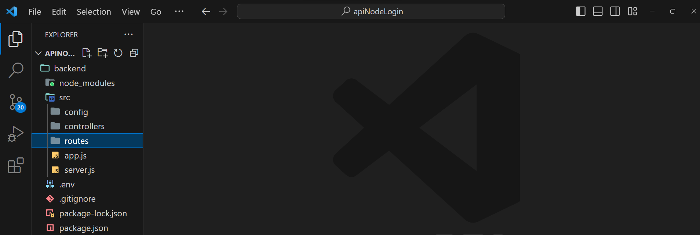

# Passo a passo API de registro e login de usuário 👨‍💻

1. Criando o banco de dados
2. Criando a API
3. Adicionar usuário
4. Listagem de usuários
5. Pesquisar usuário
6. Editar usuário
7. Excluir usuário

## 1. Criando o banco de dados
```
# Criar a database
create database sistema_login;

# Utilizar a database
use sistema_login;

# Criar a tabela de usuários
create table usuarios (
	id int auto_increment not null,
    nome varchar(120) not null,
    email varchar(120) not null,    
    senha varchar(120) not null,
    primary key (id)
);
```

## 2. Criando a API
Criar uma pasta para o projeto com o terminal
```
mkdir backend
```

Acessar a pasta criada
```
cd backend
```

Iniciar o gerenciador de pacotes Node
```
npm init -y
```

Instalar pacotes para criar a API
```
npm i express nodemon dotenv mysql2 cors bcrypt jsonwebtoken
```
#### Explicação dos pacotes
* express: será o servidor da api;
* nodemon: atualizar os arquivos alterados sem parar o servidor;
* dotenv: gerenciador de variáveis de ambiente;
* mysql2: configura conexão com banco de dados mysql;
* cors: utilizado pelos navegadores para compartilhar recursos entre diferentes origens;
* bcrypt: criptografia do tipo hash para dados;
* jsonwebtoken: utilizado para autenticação e autorização de usuários;

Criar arquivo .gitignore
```
touch .gitignore
```

Criar arquivo .env
```
touch .env
```

Abrir o VSCode
```
code .
```

Informar arquivos no .gitignore
```
node_modules
.env
```

Informar as variáveis de ambiente que serão utilizadas no .env
```
# Definir a porta do servidor. Ex: 3000
PORT = 3008

# DB_HOST: Domínio do servidor. Ex: 'localhost'
# DB_USER: Usuário do banco de banco de dados. Ex: 'root'
# DB_PASSWORD: Senha do banco de banco de dados. Ex: 'root'
# DB_DATABASE: Nome da base de dados criada. Ex: 'sistema_login'

DB_HOST = 'localhost'
DB_USER = 'root'
DB_PASSWORD = 'root'
DB_DATABASE = 'sistema_login'
```

### Estrutura de pastas e arquivos do projeto
Criar pasta src na raiz
```
mkdir src
```

Dentro da pasta src criar os arquivos app.js e server.js
```
touch src/app.js && touch src/server.js
```

#### Explicação dos arquivos
* app.js: arquivo de configuração
* server.js: arquivo responsável pela inicialização da api

Dentro da pasta src criar as pastas config, controllers e routes
```
mkdir src/config src/controllers src/routes
```

#### Explicação das pastas
* config: gerencia configurações do ambiente
* controllers: funções que acessam o banco de dados
* routes: arquivos de rotas disponibilizadas pela api

<hr>

#### Imagem da estrutura incial do projeto



<hr>

#### Iniciar configurações dos arquivos

Abrir o arquivo app.js e informar as configurações da api
```
// Importar o pacote express (servidor)
const express = require('express');
// Importar o cors para lidar com requisições externas
const cors = require('cors');
// Importar as rotas para serem executadas na aplicação
const userRouter = require('./routes/userRouter');
const loginRouter = require('./routes/loginRouter');
// Importar o pacote dotenv, gerenciador de variáveis de ambiente
const dotenv = require('dotenv').config();

// Instanciar o express na variável app
const app = express();

// Habilitar o recebimento de requests em formato JSON
app.use(express.json());
// Habilitar o uso dos cors no servidor
app.use(cors())
// Habilitar as rotas na aplicação
app.use('/api', userRouter);
app.use('/api/auth', loginRouter);
// Setar a porta do servidor, a parir do arquivo .env
app.set('port', process.env.PORT || 3333);

module.exports = app;
```

Abrir o arquivo server.js e importar as configurações para iniciar a api

```
// Importar o arquivo app
const app = require('./app');
// Importar a porta do servidor
const port = app.get('port');

// Testar API
app.listen(port, () => console.log(`Run on port ${port}!`));
```

Criar arquivo db.js na pasta config
```
touch src/config/db.js
```
Abrir o arquivo db.js e informar as configurações com o banco de dados
```
// Importar o pacote do mysql
const mysql = require('mysql2');

// Importar o pacote de acesso aos de variáveis de ambiente
const dotenv = require('dotenv').config();

// Estabelece a criação da conexão com banco 
const connection = mysql.createConnection({
    host: process.env.DB_HOST,
    user: process.env.DB_USER,
    password: process.env.DB_PASSWORD,
    database: process.env.DB_DATABASE,
});

// Testa se o banco esta conectado
connection.connect(function(err) {
    if (err) {
        throw err;
    } else {        
        console.log("Mysql Connected!");
    }
});

module.exports = connection;
```

Criar arquivo userController.js na pasta controllers
```
touch src/controllers/userController.js
```
Abrir o arquivo userController.js e informar as configurações
```
// Importa as configurações do banco de dados na variável connection
const connection = require('../config/db');

// Pacote para criptografar a senha de usuario
const bcrypt = require('bcrypt');

// Função que retorna todos usuários no banco de dados
async function listUsers(request, response) {
    // Preparar o comando de execução no banco
    connection.query('SELECT * FROM users', (resultserr, ) => { 
        try {  // Tenta retornar as solicitações requisitadas
            if (results) {  // Se tiver conteúdo 
                response.status(200).json({
                    success: true,
                    message: 'Retorno de usuarios com sucesso!',
                    data: results
                });
            } else {  // Retorno com informações de erros
                response
                    .status(400)
                    .json({
                        success: false,
                        message: `Não foi possível retornar os usuários.`,
                        query: err.sql,
                        sqlMessage: err.sqlMessage
                    });
            }
        } catch (e) {  // Caso aconteça qualquer erro no processo na requisição, retorna uma mensagem amigável
            response.status(400).json({
                succes: false,
                message: "Ocorreu um erro. Não foi possível realizar sua requisição!",
                query: err.sql,
                sqlMessage: err.sqlMessage
            })
        }   
    });
}

// Função que cria um novo usuário 
async function storeUser(request, response) {
    // Preparar o comando de execução no banco
    const query = 'INSERT INTO users(name, email, password, status) VALUES(?, ?, ?, ?);';

    // Recuperar os dados enviados na requisição
    const params = Array(
        request.body.name,
        request.body.email,
        bcrypt.hashSync(request.body.password, 10),
        request.body.status
    );

    // Executa a ação no banco e valida os retornos para o client que realizou a solicitação
    connection.query(query, params, (err, results) => {
        try {
            if (results) {
                response
                    .status(201)
                    .json({
                        success: true,
                        message: `Sucesso! Usuário cadastrado.`,
                        data: results
                    });
            } else {
                response
                    .status(400)
                    .json({
                        success: false,
                        message: `Não foi possível realizar o cadastro. Verifique os dados informados`,
                        query: err.sql,
                        sqlMessage: err.sqlMessage
                    });
            }
        } catch (e) { // Caso aconteça algum erro na execução
            response.status(400).json({
                    succes: false,
                    message: "Ocorreu um erro. Não foi possível cadastrar usuário!",
                    query: err.sql,
                    sqlMessage: err.sqlMessage
                });
        }
    });
}

// Função que atualiza o usuário no banco
async function updateUser(request, response) {
    // Preparar o comando de execução no banco
    const query = "UPDATE users SET `ds_nome` = ?, `ds_password` = ?, `fl_status` = ? WHERE `id_user` = ?";

    // Recuperar os dados enviados na requisição respectivamente
    const params = Array(
        request.body.ds_nome,
        bcrypt.hashSync(request.body.ds_password, 10),
        request.body.fl_status,
        request.params.id  // Recebimento de parametro da rota
    );

    // Executa a ação no banco e valida os retornos para o client que realizou a solicitação
    connection.query(query, params, (err, results) => {
        try {
            if (results) {
                response
                    .status(200)
                    .json({
                        success: true,
                        message: `Sucesso! Usuário atualizado.`,
                        data: results
                    });
            } else {
                response
                    .status(400)
                    .json({
                        success: false,
                        message: `Não foi possível realizar a atualização. Verifique os dados informados`,
                        query: err.sql,
                        sqlMessage: err.sqlMessage
                    });
            }
        } catch (e) { // Caso aconteça algum erro na execução
            response.status(400).json({
                    succes: false,
                    message: "Ocorreu um erro. Não foi possível atualizar usuário!",
                    query: err.sql,
                    sqlMessage: err.sqlMessage
                });
        }
    });
}

// Função que remove usuário no banco
async function deleteUser(request, response) {
    // Preparar o comando de execução no banco
    const query = "DELETE FROM users WHERE `id_user` = ?";

    // Recebimento de parametro da rota
    const params = Array(
        request.params.id
    );

    // Executa a ação no banco e valida os retornos para o client que realizou a solicitação
    connection.query(query, params, (err, results) => {
        try {
            if (results) {
                response
                    .status(200)
                    .json({
                        success: true,
                        message: `Sucesso! Usuário deletado.`,
                        data: results
                    });
            } else {
                response
                    .status(400)
                    .json({
                        success: false,
                        message: `Não foi possível realizar a remoção. Verifique os dados informados`,
                        query: err.sql,
                        sqlMessage: err.sqlMessage
                    });
            }
        } catch (e) { // Caso aconteça algum erro na execução
            response.status(400).json({
                    succes: false,
                    message: "Ocorreu um erro. Não foi possível deletar usuário!",
                    query: err.sql,
                    sqlMessage: err.sqlMessage
                });
        }
    });
}

module.exports = {
    listUsers,
    storeUser,
    updateUser,
    deleteUser
}
```

Criar arquivo loginController.js na pasta controllers
```
touch src/controllers/loginController.js
```
Abrir o arquivo loginController.js e informar as configurações

```
// Importa as configurações do banco de dados na variável connection
const connection = require('../config/db');
// Importar o pacote dotenv, gerenciador de variáveis de ambiente
require("dotenv").config();
// Pacote para criptografar a senha de usuario
const bcrypt = require('bcrypt');
// Importar pacote que implementa o protocolo JSON Web Token
const jwt = require('jsonwebtoken');

// Authentication
async function login(request, response) {
    // Preparar o comando de execução no banco
    const query = "SELECT * FROM users WHERE `email` = ?";
    
    // Recuperar credenciais informadas
    const params = Array(
        request.body.email
    );

    // Executa a ação no banco e valida os retornos para o client que realizou a solicitação
    connection.query(query, params, (err, results) => {
        try {            
            if (results.length > 0) {                
                bcrypt.compare(request.body.password, results[0].password, (err, result) => {
                    if (err) {                        
                        return response.status(401).send({
                          msg: 'Email or password is incorrect!'
                        });
                    } else if(result) {
                        const id = results[0].id_user;
                        const token = jwt.sign({ userId: id },'the-super-strong-secrect',{ expiresIn: 300 });
                        results[0]['token'] = token; 
                        
                        response
                        .status(200)
                        .json({
                            success: true,
                            message: `Sucesso! Usuário conectado.`,
                            data: results
                        });
                    }
                })
                
            } else {
                response
                    .status(400)
                    .json({
                        success: false,
                        message: `Não foi possível realizar a remoção. Verifique os dados informados`,
                        query: err.sql,
                        sqlMessage: err.sqlMessage
                    });
            }
        } catch (e) { // Caso aconteça algum erro na execução
            response.status(400).json({
                    succes: false,
                    message: "Ocorreu um erro. Não foi possível deletar usuário!",
                    query: err,
                    sqlMessage: err
                });
        }
    });
}

module.exports = {
    login
}
```

Criar arquivo userRouter.js na pasta routes
```
touch src/routes/userRouter.js
```
Abrir o arquivo userRouter.js e informar as configurações
```
// Importar o modulo de Router do express
const { Router } = require('express');
// Instanciar o Router na variável router
const router = Router();

// Importar as funções (processamento da requisição) do controller
const { 
    listUsers,
    storeUser,
    updateUser,
    deleteUser
} = require('../controllers/userController')

// Criar os endpoints (rotas) que serão acessados a partir dos métodos HTTP (get,post,put,delete)
router.get('/users', listUsers);
router.post('/user/create', storeUser);
router.put('/user/:id', updateUser);
router.delete('/user/:id', deleteUser);

module.exports = router;
```


Criar arquivo loginRouter.js na pasta routes
```
touch src/routes/loginRouter.js
```
Abrir o arquivo loginRouter.js e informar as configurações
```
// Importar o modulo de Router do express
const { Router } = require('express');
// Instanciar o Router na variável router
const router = Router();
// Importar as funções (processamento da requisição) do controller
const { login } = require('../controllers/loginController');

router.post('/login', login);

module.exports = router;
```